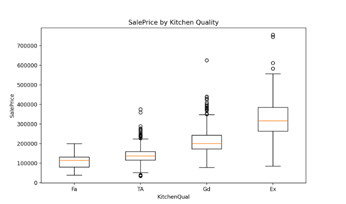
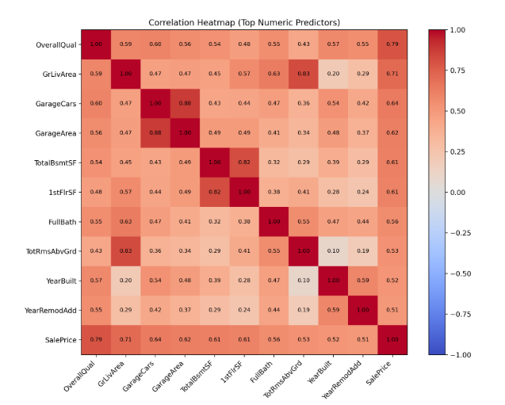
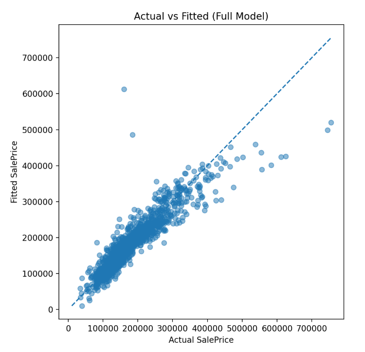

# House Price Analytics & Prediction

## Overview

This project analyzes housing data from the Kaggle House Prices dataset to identify the features most strongly associated with sale price and to build a regression model for predicting house prices.

The analysis includes data cleaning, exploratory data analysis, feature selection, regression modeling, model comparison, and prediction on unseen test data.

## Dataset

The training dataset contains 1,460 housing records with numerical and categorical features describing property characteristics such as:

- Overall quality
- Living area
- Garage capacity
- Basement size
- Kitchen quality
- Neighborhood
- Year built

## Tools & Technologies

- Python
- Pandas
- NumPy
- Statsmodels
- Matplotlib
- Jupyter Notebook

## Exploratory Data Analysis

Exploratory analysis was used to understand the distribution of house prices and identify important predictors.

Some of the strongest numerical relationships with sale price were:

- Overall Quality
- Above-Ground Living Area
- Garage Capacity
- Garage Area
- Total Basement Area

## Visualizations

### Sale Price by Kitchen Quality

The boxplot shows a clear relationship between kitchen quality and sale price. Homes with higher kitchen-quality ratings generally have higher median sale prices.



### Correlation Heatmap

The correlation heatmap highlights the numerical variables most strongly associated with `SalePrice`. `OverallQual` and `GrLivArea` show some of the strongest positive relationships with sale price.



### Actual vs Fitted Values

The actual vs fitted plot compares observed sale prices with the values predicted by the final regression model. The strong positive relationship indicates that the model captures the overall pricing trend well, although some larger errors remain for higher-priced properties.



## Regression Models

Three regression models were compared:

- Full Model
- Reduced Model
- Interaction Model

Model performance was evaluated using:

- R²
- Adjusted R²
- AIC
- BIC

The full model achieved the strongest overall performance with an R² of approximately **0.842**, explaining about **84% of the variation in house sale prices**.

## Key Findings

- Overall home quality was one of the strongest predictors of sale price.
- Larger above-ground living areas were associated with higher prices.
- Garage capacity, basement area, kitchen quality, and neighborhood also contributed to house value.
- The final regression model was used to generate predictions for 1,459 unseen properties.

## Repository Structure

```text
House-Price-Analytics/
├── notebooks/
│   └── house_price_analysis.ipynb
├── outputs/
│   └── final_predictions.csv
├── report/
│   └── house_price_analysis_report.pdf
├── images/
│   ├── kitchen_quality_boxplot.png
│   ├── correlation_heatmap.png
│   └── actual_vs_fitted.png
├── README.md
├── .gitignore
└── LICENSE
